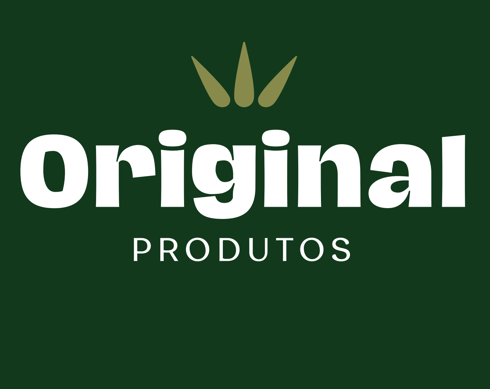

<p align="center">
  
</p>

<h1 align="center">Original Produtos - Palitos de Churrasco</h1>

<p align="center">
  Projeto do website da Original Produtos, especializada em palitos de churrasco, com foco em qualidade e tradição desde 1985.
</p>

<p align="center">
  
  
  
  
</p>

---

## 📝 Descrição do Projeto

Esse projeto é o site oficial da **Original Produtos**, criado para exibir nossos produtos de palitos de churrasco com uma interface moderna e responsiva. O site conta com um carrossel de imagens, integração com WhatsApp para contato rápido e um layout otimizado para dispositivos móveis.

---

## 🚀 Tecnologias Utilizadas

As principais tecnologias e ferramentas utilizadas no desenvolvimento do projeto são:

<p align="center">
  
  &nbsp;
  
  &nbsp;
  
</p>

- **PHP** - Linguagem principal para desenvolvimento back-end.
- **Bootstrap** - Biblioteca CSS para estilização e criação de componentes responsivos.
- **CSS3** - Utilizado para estilizações adicionais e personalizações.


## 📦 Estrutura do Projeto

```plaintext
├── components/
│   # Carrossel de imagens
│   # Cabeçalho do site
│   # Rodapé do site
├── assets/
│   ├── css/
│   │   └── styles.css   # Arquivo de estilos CSS personalizados
│   ├── img/
│   │    # Logo da Original Produtos
│   │    # Imagem 1 do carrossel
│   │    # Imagem 2 do carrossel
│   └──  # Imagem 3 do carrossel
│ 
├── index.php             # Página principal do site
│
├── scripts/
│       └── main.js # JavaScript Do Site
```

---

## ⚙️ Funcionalidades

- **Carrossel de Imagens:** Destaca produtos e diferenciais da marca com transições animadas.
- **Botão de Contato no WhatsApp:** Acesso rápido ao WhatsApp, fixo no site para uma comunicação prática.
- **Layout Responsivo:** Interface adaptável para dispositivos móveis e desktop.

---

## 🚀 Como Executar o Projeto

1. Clone este repositório:

   ```bash
   git clone https://github.com/seuusuario/original-produtos.git
   ```

2. Navegue até o diretório do projeto:

   ```bash
   cd original-produtos
   ```

3. Coloque o projeto em um servidor local (por exemplo, usando o XAMPP) para visualizar o site.


<p align="center">Feito com ❤️ por Original Produtos</p>


---
